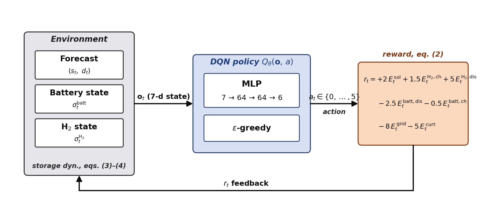
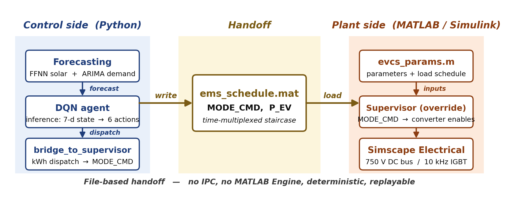
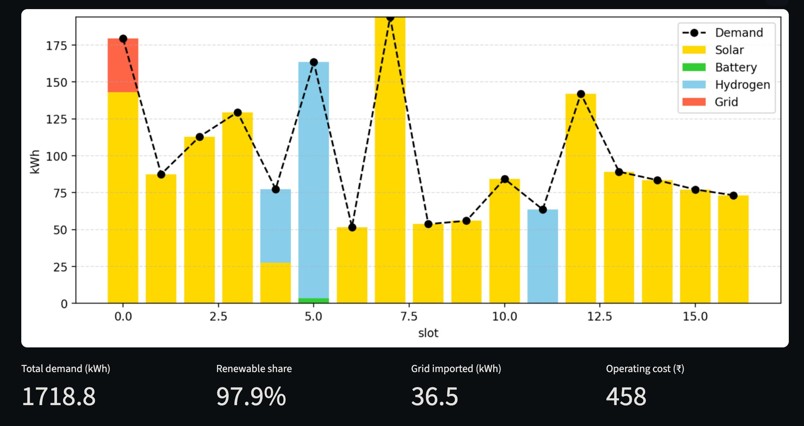
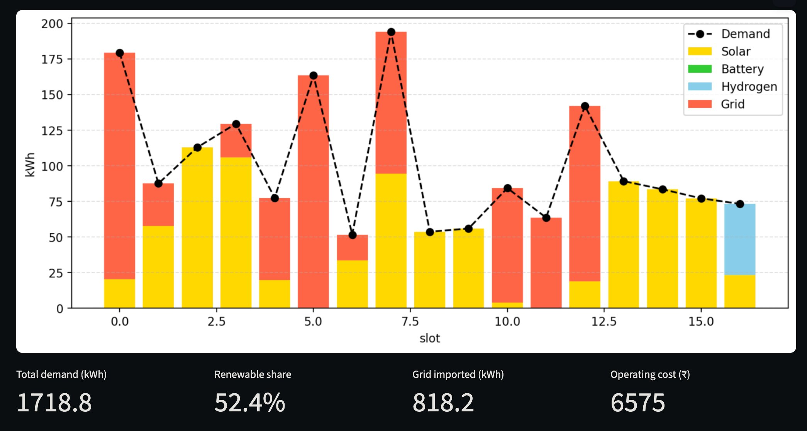
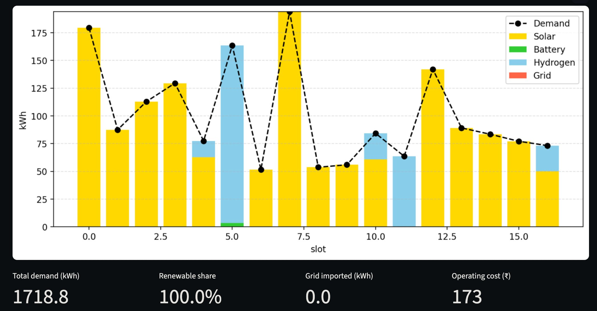

# RL-EMS for a Green-Hydrogen EV Charging Station

> A reinforcement-learning Energy Management System that decides how a hybrid EV
> charging station dispatches solar, battery, hydrogen, and grid power — then verifies
> the decisions on a switched-converter Simulink / Simscape Electrical model.

<p align="center">
  
</p>

The agent forecasts solar generation and charging demand for any location and date,
chooses a dispatch strategy with a **Deep Q-Network**, and the resulting schedule drives
a high-fidelity power-electronics model so every decision is checked against real physics
— not just an idealised energy-balance table.

---

## Highlights

- **End-to-end pipeline** — location + date in, physically-verified dispatch out.
- **Green-hydrogen-aware RL** — a reward function that prefers stored hydrogen, protects
  battery cycle life, and uses the grid only as a last resort.
- **Software-in-the-loop verification** — the RL schedule drives a Simscape Electrical
  model (50 kW PV, 100 kWh BESS, 50 kW PEM fuel cell, 415 V grid, 750 V DC bus).
- **Interactive dashboard** — a Streamlit front-end for live forecasting, dispatch, and
  Simulink hand-off.
- **Generalises across climates** — the same trained policy is evaluated on three Indian
  regimes with no retraining.

---

## Results

Benchmarked against a deterministic rule-based controller over a one-year horizon at
15-minute resolution (identical demand and weather inputs):

| Metric | Rule-based EMS | **RL-based EMS** | Improvement |
|---|---|---|---|
| Renewable penetration | 95.0 % | **100.0 %** | +5.0 pp |
| Grid energy imported | 81.9 kWh | **0.0 kWh** | −100 % |
| Operating cost | ₹805 | **₹191** | **−76.3 %** |

> The RL agent eliminates grid imports entirely and cuts operating cost by three-quarters.
> (Curtailment rises modestly — a *consequence* of no longer leaning on the grid as a
> backstop, since surplus solar beyond storage capacity has nowhere to go.)

---

## How it works

<p align="center">
  
</p>

Three decoupled tiers, joined by a single `.mat` file:

1. **Control side (Python)** — `forecasting.py` predicts solar (FFNN) and demand (ARIMA);
   `rl_agent.py` rolls out the trained DQN; `bridge_to_supervisor.py` converts the
   per-slot dispatch into a `MODE_CMD` signal.
2. **Hand-off** — everything is written to `data/ems_schedule.mat`. A file, not a live
   socket: deterministic, version-controllable, replayable. No MATLAB Engine dependency.
3. **Plant side (MATLAB)** — `evcs_params.m` loads the schedule, the supervisor's
   `MODE_CMD` override picks it up, and Simscape runs the full switched-IGBT physics.

---

## Cross-climate robustness

The **same policy weights** evaluated on three contrasting regimes — only the dashboard
inputs change, no retraining:

### Pre-monsoon baseline — Roorkee, 1–3 May 2025
**97.9 % renewable · 36.5 kWh grid · ₹458**
<p align="center"></p>

### Monsoon solar scarcity — Mumbai, 15–17 Jul 2025
**52.4 % renewable · 818 kWh grid · ₹6575**
<p align="center"></p>

### High-altitude solar abundance — Leh, 15–17 May 2025
**100 % renewable · 0 kWh grid · ₹173**
<p align="center"></p>

The agent prioritises direct solar, then stored renewables, with grid as the residual —
and the balance shifts automatically with the available headroom in each regime.

---

## Quick start

### Prerequisites
- Python 3.12 (conda recommended)
- MATLAB R2024b with **Simscape Electrical** (for the plant-side simulation)

### 1. Install

```bash
git clone https://github.com/akshattri/RL-Based-Energy-Management-System-for-EVCS.git
cd ems_demo
pip install -r requirements.txt
```

### 2. Generate a dispatch schedule

```bash
python precompute.py "Roorkee, India" 3 2025-05-01
```

This forecasts, runs the RL rollout, and writes `data/precomputed.pkl` (for the
dashboard) and `data/ems_schedule.mat` (for Simulink).

### 3. Explore in the dashboard

```bash
streamlit run app.py
```

Open <http://localhost:8501>, enter a location / horizon / start-date, and click
**Run pipeline**. Tabs: Forecast · RL Strategy · Simulink Signals.

### 4. Verify on the plant model (MATLAB)

```matlab
>> cd ems_demo
>> demo(540)        % runs the full 3-day schedule (compressed timebase)
```

`demo(N)` loads parameters, sets the stop time to `N` seconds, opens the EMS scopes,
runs the simulation, and saves the output to `data/sim_runs/`.

---

## The RL formulation

| Element | Definition |
|---|---|
| **Algorithm** | Deep Q-Network (Stable-Baselines3), MLP `7→64→64→6` |
| **State (7-d)** | solar, demand, battery SOC, H₂ SOC, pending H₂, lookahead deficit, slot-of-day |
| **Actions (6)** | idle · electrolyser {25/50/100 %} · fuel cell {25/50 %} |
| **Reward** | `+2·solar +1.5·H₂_charge +5·FC_discharge −2.5·batt_dis −0.5·batt_ch −8·grid −5·curtailed` |
| **Training** | 50 000 steps (~20 s on CPU), 15 % solar / 10 % demand noise for robustness |

The reward encodes three priorities: **discourage battery cycling** (asymmetric
charge/discharge penalties), **prefer green hydrogen** (FC-discharge rewarded more than
electrolyser charging, so the agent can't game it by over-producing H₂), and **use grid
last** (highest penalty).

---

## Repository structure

```
ems_demo/
├── app.py                    # Streamlit dashboard
├── forecasting.py            # geocode + Open-Meteo + FFNN solar / ARIMA demand
├── rl_agent.py               # gym environment + DQN train / rollout
├── simulink_bridge.py        # rollout → reference signals → .mat
├── bridge_to_supervisor.py   # rollout → MODE_CMD + P_EV (time-multiplexed)
├── precompute.py             # CLI: forecast → rollout → .mat + .pkl
├── matlab_runner.py          # (optional) Streamlit→MATLAB trigger — unused
├── requirements.txt
│
├── EVCS_model_v2.slx         # the working Simulink model
├── evcs_params.m             # parameters + auto-loads the schedule
├── build_ems_references.m    # one-shot model patcher (FC sizing + EMS subsystem)
├── demo.m                    # one-click demo runner
├── run_simulation.m          # alternate run script
│
├── assets/                   # README figures
├── data/                     # generated .mat / .pkl + cached API responses
├── docs/                     # report, figures, presentation
└── models/                   # trained DQN, FFNN, scalers, demand basis
```

---

## Scope & limitations

- The supervisor is **mutually exclusive** — within a slot only one source feeds the EV
  (time-multiplexed when the RL decision mixes sources). Simultaneous droop-based
  multi-source dispatch is future work.
- The EV charger runs at its **rated point**; the supervisor uses forecasted demand for
  source selection. Closing the loop on the charger setpoint is a planned extension.
- The hydrogen **electrolyser + tank** are modelled in the RL formulation but abstracted
  in the Simscape plant (the fuel cell represents on-demand H₂ delivery).
- Demand comes from a fixed historical profile, so high-demand / grid-outage scenarios
  require code changes rather than dashboard inputs.

---

## 🛠️ Tech stack

**ML / RL:** PyTorch · Stable-Baselines3 · Gymnasium · TensorFlow (FFNN) · scikit-learn
**Data:** pandas · NumPy · SciPy · Open-Meteo API
**Plant model:** MATLAB · Simulink · Simscape Electrical
**Interface:** Streamlit

---

## License

Released under the [MIT License](LICENSE).

---

## Acknowledgements

Weather data from the [Open-Meteo](https://open-meteo.com/) historical archive.
Charging-demand data from the Perth & Kinross open-data portal. Solar generation data
from a public Kaggle dataset. RL implementation built on
[Stable-Baselines3](https://github.com/DLR-RM/stable-baselines3).
